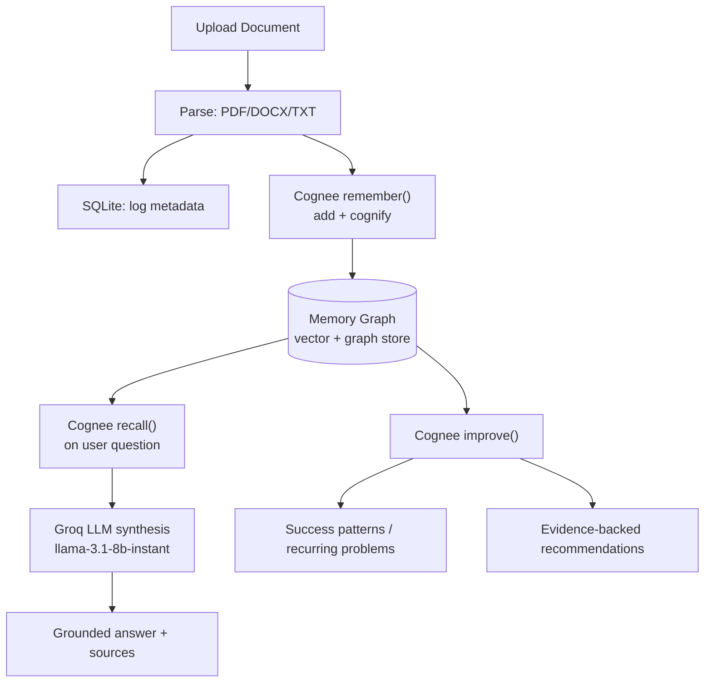

# LegacyDNA

**Organizational memory for event teams.** Every year, a new team plans the same festival from scratch — because the people who learned last year's lessons already graduated. LegacyDNA turns scattered event reports, meeting notes, and sponsor records into a queryable memory graph, so institutional knowledge survives team turnover.

## What it does

Upload messy, real-world documents — post-event reports, sponsor contracts, meeting notes — and LegacyDNA:
- **Remembers** them in a Cognee-powered memory graph (vector + graph hybrid)
- **Recalls** answers to natural-language questions, grounded in evidence
- **Improves** by extracting recurring success patterns and problems across documents
- Turns those patterns into **evidence-backed recommendations** for next year's team

## Why Memory Matters

Student organizations face a recurring problem: every year, experienced organizers graduate and their lessons disappear with them.

New teams often repeat mistakes, lose sponsor knowledge, forget logistical lessons, and restart planning from scratch.

LegacyDNA preserves institutional memory using Cognee's memory lifecycle:

- Remember past event knowledge through document ingestion
- Recall historical decisions and lessons through natural-language queries
- Improve memory by identifying recurring success patterns and failures
- Generate recommendations from accumulated organizational experience
- Support future memory-retirement workflows through the forget lifecycle

LegacyDNA is designed as an organizational memory system rather than a simple document-search tool.

## Architecture

Documents
   ↓
Remember()
   ↓
Cognee Memory Layer
(Graph + Vector Memory)
   ↓
Recall() → Answers

Improve() → Insights → Recommendations



## Tech Stack

- **Backend:** Python / FastAPI
- **Memory Layer:** [Cognee](https://www.cognee.ai/) (hybrid vector + knowledge graph)
- **LLM:** Groq (`llama-3.1-8b-instant`, via LiteLLM)
- **Metadata storage:** SQLite
- **Frontend:** Next.js

> Note: earlier design docs referenced Gemini for response generation. The team switched to Groq during implementation for speed and cost; this README reflects the current, actual implementation.

## API Endpoints

| Endpoint | Method | Status | Description |
|---|---|---|---|
| `/api/upload` | POST | ✅ Working | Upload + parse + ingest a document into memory |
| `/api/query` | POST | ✅ Working | Ask a natural-language question, get a grounded answer |
| `/api/insights` | GET | ✅ Working | Extract success patterns & recurring problems from memory |
| `/api/recommendations` | GET | ✅ Working | Generate evidence-backed recommendations |
| `/api/compare` | POST | ⚠️ Mocked | Not yet implemented — returns placeholder data |
| `/api/memory/{id}` | DELETE | ⚠️ Stub | `forget()` not yet implemented, returns HTTP 501 |
| `/api/history` | GET | ✅ Working | List all uploaded documents |

## How to Run Locally

```bash
cd backend
pip install -r requirements.txt
uvicorn app.main:app --reload
```

Requires a `.env` file with `GROQ_API_KEY` set.

## Memory Lifecycle

LegacyDNA implements Cognee's core memory lifecycle:

LegacyDNA's primary goal is preserving institutional memory across event-team generations, not merely retrieving information from uploaded documents.

- **`remember()`** — ✅ Fully working. Ingests documents into the memory graph.
- **`recall()`** — ✅ Working. Retrieval accuracy evaluated using a 30-question gold-standard benchmark covering an 11-document evaluation dataset (`docs/question_bank.md`, `docs/test_report.md`). Some retrieval ranking inconsistency remains under investigation..
- **`improve()` / memify** — ✅ Fully working. Powers both `/insights` and `/recommendations`.
- **`forget()`** — ⚠️ Not yet implemented. Endpoint exists and returns a clear "not implemented" response rather than failing silently.

## Known Limitations

Being upfront about what's not finished:

- **`/api/compare`** currently returns hardcoded mock data, not real Cognee-backed comparison.
- **`forget()`** is not implemented — no memory deletion lifecycle yet.
- **Structured SQLite tables** (`events`, `sponsors`, `insights`, `recommendations`) exist in the schema but aren't populated — all intelligence currently comes directly from Cognee's memory graph, not from SQLite. The `documents` table (upload tracking) works correctly.
- **Retrieval consistency:** some queries return different results across identical repeat runs, most likely due to duplicate document ingestion during testing affecting result ranking. Actively being investigated.
- Some evidence/source labels surface raw internal chunk descriptions rather than clean document names — cosmetic, doesn't affect answer accuracy.

## Testing

30 gold-standard questions across 5 categories (sponsors, attendance, logistics, lessons learned, recommendations) evaluated against an 11-document benchmark dataset. Production memory currently contains additional documents beyond the benchmark set; benchmark results therefore reflect retrieval quality on the controlled evaluation dataset rather than the entire production memory.

## Presentation

LegacyDNA Hackathon Presentation:
 
- PDF version available in `presentation/LegacyDNA_Hackathon_Presentation.pdf`
- Canva version: https://www.canva.com/design/DAHOhTciGv4/zHd_0xPxqbIu1COqx7Sctw/edit 

## Demo Video

Watch the complete LegacyDNA demonstration:

🎥 YouTube Demo:
https://youtu.be/3X4II91AM3s

The demo showcases:

- Remember → Document ingestion into memory
- Recall → Evidence-backed question answering
- Improve → Organizational insights and recommendations
- Organizational memory preservation using Cognee

⚠️ Judges: Please watch until the end to see the complete Remember → Recall → Improve memory lifecycle demonstration.

## Team

- **Memory Engineer** — Cognee integration, memory lifecycle, retrieval quality
- **Backend Engineer** — FastAPI services, SQLite, API contracts
- **Frontend Engineer** — Next.js UI, evidence display, visualization
- **Product & Data Engineer** — dataset design, gold-question testing, demo & documentation

## Demo Flow

See `demo_script.md` for the full judge-facing walkthrough, and `docs/insight_scenarios.md` for expected answers to key demo questions.

## Demo Resources

- docs/demo_safe_questions.md
- docs/judge_demo_flow.md

## AI Usage Disclosure

This project was developed with assistance from AI tools including ChatGPT for ideation, documentation refinement, presentation support, code review guidance, debugging assistance, and project planning.

All architecture decisions, implementation work, integration, testing, and final project development were completed by the team.
